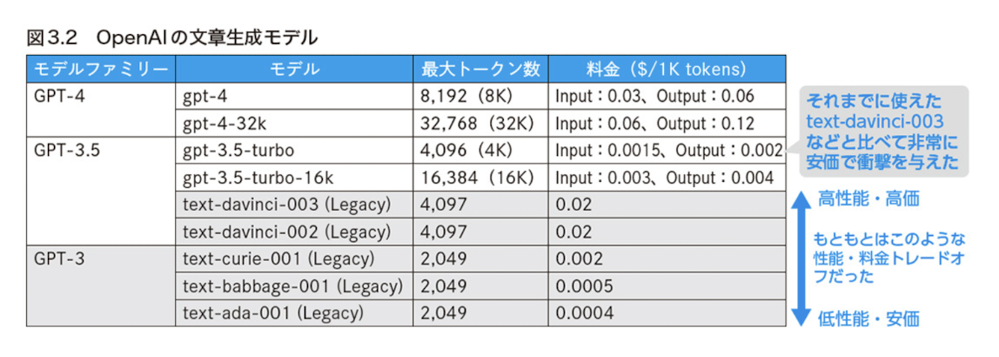
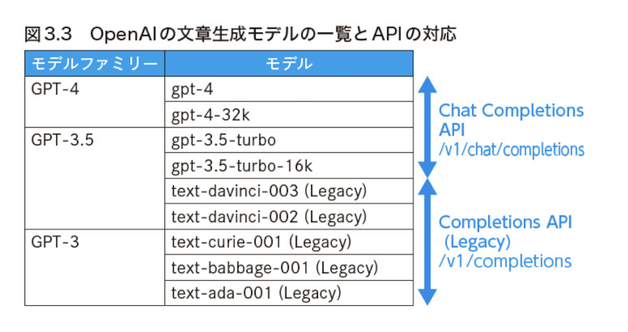

# Getting Start

## OpenAI の文書生成モデル

## OpenAI の文書生成モデルの一覧と API の対応

## Link

### Tools

- [google colab](https://colab.research.google.com/)
  - browser 上で Python などの code を入力して、その場で code を実行できる service
  - 行の先頭に「!」をつけると linux shell command を実行することあできる

### Open AI

- [open AI prompt engineering](https://platform.openai.com/docs/guides/prompt-engineering)
- [Best practices for prompt engineering with the OpenAI API](https://help.openai.com/en/articles/6654000-best-practices-for-prompt-engineering-with-the-openai-api)

#### Open AI references

- [OpenAI models](https://platform.openai.com/docs/models)
- [OpenAI Pricing](https://openai.com/pricing)
- [OpenAI deprecations](https://platform.openai.com/docs/deprecations/)
- [Tokenizer](https://platform.openai.com/tokenizer)
  - 入力したテキストがトークンとしてどのように分割され、トークン数はいくつなのかを確認できます。

### Guide

- [prompt engineer guide](https://www.promptingguide.ai/jp/introduction/elements)

### Blog

- [画像付きのノベルゲームを遊べるプロンプトを作ったら臨場感が溢れすぎた話](https://note.com/churin_1116/n/n1e3697c9db7f)
