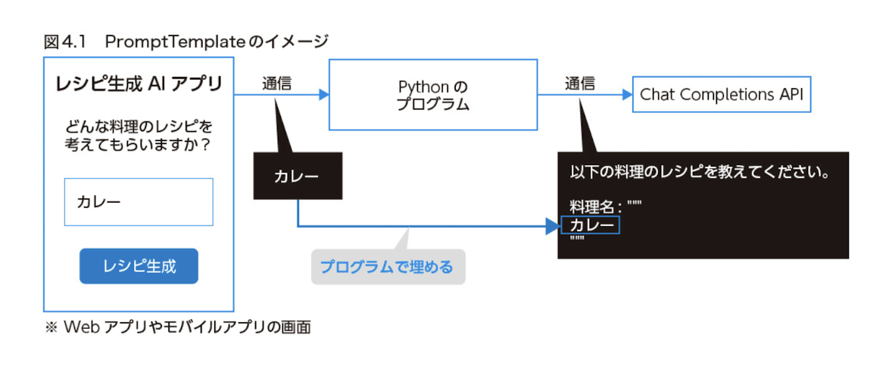

# [Langchain](https://python.langchain.com/docs/modules/)

- [code](https://colab.research.google.com/drive/116W16n0N83r7GkTv3W9qnXprdtMm2r4o#scrollTo=BaEj6h8yF2xl)

LLM を使った Application 開発 framework です。LLM を使ったさまざまな種類の application で使うことができます。

## Langchain の usecase

langchain には、大きく２つの側面があります。

- １つは、LLM を使った application 開発に必要な部品を、抽象化された module として提供していることです。
- もう一つは、特定の usecase に特化した機能を提供していることです。

LLM を使った application としては、次のような例が挙げられます

- chatGPT のように会話できる chatbot
- 文書の予約 Tool
- 社内文書や PDF file への Q&A application
- あとほど解説する「AI Agent」

LLM を使った application 開発に使える framework, library は langChain 意外にもたくさんあります。いくつか例を挙げると以下の物などが有名です。

- [LlamaIndex](https://github.com/jerryjliu/llama_index)
  - LangChain の Data connection 機能に特化した framework
- [Semantic Kernel](https://github.com/microsoft/semantic-kernel)
- [Guidance](https://github.com/microsoft/guidance)

---

## LangChain module

LangChain module は大きく次の 6 つに整理されています。

- Model I/O
  - Prompts
    - Prompt Templates
    - Example selector
  - Language models
    - LLMs
    - Chat models
- Data connection
  - Document loaders
  - Document transformers
    - text splitters
    - post retrieval
  - Text embedding modesl
  - Vector stores
  - Retrievers
- Chains
- Agents
  - Agent Types
  - Tools
  - ToolKits
- Memory
- Callbacks

## 4.2 Language models

Language models は、LangChain での言語モデルの使用方法を提供する module です。LangChain の Language models を使うことで、さまざまな Language model を共通の Interface で使用することができます。簡単にいってしまえば、 LLM を LangChain 流で使えるようにする Wrapper のことです。LangChain では Language model を LLMS, Chat models の大きく２種類に整理しています。

### LLMs

1 つの text input に対して１つの text output を返す、典型的な大規模言語 model を扱う module です。

### Callback を使った streaming

Chat Completions API は streaming で応答を得ることができます。LLM を使った application を実装する場合、UX の工場を目的として、steaming で応答を得たいことが多いはずです。

LangChain では、Callback 機能を使うことで chat Completions API の応答を streaming で処理することが可能です。

例えば、LangChain が提供している StreamingStdOutCallbackHandler を ChatOpenAI を設定すると、生成されて text が streaming で標準出力に表示されます。

```py
from langchain.callbacks.streaming_stdout import StreamingStdOutCallbackHandler
from langchain_openai import ChatOpenAI
from langchain_core.messages import HumanMessage

chat = ChatOpenAI(
    model_name="gpt-3.5-turbo",
    temperature=0,
    streaming=True,
    callbacks=[StreamingStdOutCallbackHandler()],
)

messages = [HumanMessage(content="自己紹介してください")]
result = chat(messages)
```

LangChain の callback 機能では、前述の StreamingStdOutCallbackHandler のように公式で提供されているものを使うこともできれば、Custom Callback Hander を日そうして使うこともできます。

Custom CallbackHandler を使うと

- LLM の処理開始 (on_lim_start)
- 新しい Token の生成 (on_lim_new_token)
- LLM 処理の終了 (on_lim_end)

などの timing で、任意の処理を実行することができます。

## 4.3 prompts

### PromptTemplate



### [Example Selectors](https://python.langchain.com/docs/modules/model_io/prompts/example_selectors)

Few-show prompting を使うと、LLM から期待する応答を得やすくなります。
「Example Selectors」は、Few-shot prompting で使う例を選択する機能です。

Example selectors を使うと、例を埋め込む際に次のような処理が可能となっています。

- prompt の長さの最大値を小エア内容にする目的で、ユーザーの入力が短い場合はたくさんの例を埋め込み、ユーザーの入力が長い場合は少ない例を埋め込む
- ユーザーの入力内容に近い例を自動的に選択して埋め込む

## 4.4 Output Parsers

Output Parser は、

- JSON などの output 形式を指定する prompt 作成と
- 応答の text の python object への変換機能を提供します。

Output Parsers を使うと、LLM の応答から該当箇所を抽出して python object に mapping するという定番の処理を簡単に実装できます。

### PydanticOutputParser を使った Python Object の取得

PydanticOutputParser を使うことで、LLM の出力から Python object を簡単に取得できます。

LLM が出力したレシピを Receipi class の instance に自動で変換する例を見ていきます。

```python
from langchain.chat_models import ChatOpenAI
from langchain.output_parsers import PydanticOutputParser
from langchain.prompts import PromptTemplate
from pydantic import BaseModel, Field

# 1. まず、LLMに出力させたい「材料一覧（ingredients）」と「手順（steps）」を
#    フィールドとするRecepiクラスを、Pydantic model として定義します。
class Recipe(BaseModel):
   ingredients: list[str] = Field(description="ingredients of the dish")
   steps: list[str] = Field(description="steps to make the dish")

# -------------

# 2. このRecipeクラスを与えて、PydanticOutputParserを作成します。
output_parser = PydanticOutputParser(pydantic_object=Recipe)

template = """料理のレシピを考えてください。

{format_instructions}

料理名: {dish}
"""

# 3. そして、PydanticOutputParserから、プロンプトに含める出力形式の説明文を作成します。
#    ここで作成したformat_instructionsは、Recipeクラスに対応した出力形式の指定の文字列です。
format_instructions = output_parser.get_format_instructions()

prompt = PromptTemplate(
   template=template,
   input_variables=["dish"],
   partial_variables={"format_instructions": format_instructions}
)

chat = ChatOpenAI(model_name="gpt-3.5-turbo", temperature=0)
formatted_prompt = prompt.format(dish="カレー")

# --------
from langchain.chains import LLMChain

chain = LLMChain(prompt=prompt, llm=chat, output_parser=output_parser)
recipe = chain.run(dish="カレー")

print(type(recipe))
print(recipe)
```

Output parser を使う例での Point は以下の 2 つです。

- Recipe class の定義をもとに、出力系 s 機を指定する文字列が自動的に作られた
- LLM の出力を簡単に Recepi Class instance に交換できた

## 4.5 Chains

### LLMChain - PromptTemplate・Language model・OutputParser を繋ぐ


### SimpleSequentialChain - Chain と Chain を繋ぐ

chain と chain を接続する chain も存在します。SimpleSequentialChain を使うと、Chain と Chain を直列に連結できます。


SimpleSequentialChain を使うと、さまざまな Chain を直列に接続することができます。Chain 同志を接続する Chain としては、他にも複数の入力に対応した SequentialChain や、LLM の判断で Chain の分岐を実現する LLMRouterChain などがあります。


| chain                                 | summary                                                                                                                                                                                    |
| ------------------------------------- | ------------------------------------------------------------------------------------------------------------------------------------------------------------------------------------------ |
| OpenAIModerationChain                 | OpenAI の Moderation API により、 Text が Open AI の利用 Policy に反していないか Check する                                                                                                |
| LLMRequestsChain                      | 指定した URL に HTTP request を送信し、 response に踏まえて LLM に質問に高騰させる                                                                                                         |
| OpenAPIEndpointChain                  | 自然言語で入力を与えると、Open API 仕様 (swagger) をもとに LLM が API request を生成し、その内容で API を呼び出す。さらに、API からの response を踏まえて LLM に質問を高騰させることも可能 |
| PALChain (Experimental-実験的)        | 自然言語の入力をもとに、LLM が program を生成し、program を実行した結果を返す「PAL: program-aided Lnaguage Models」という論文に基づく実装                                                  |
| SQLDatabaseChain(Experimental-実験的) | 自然言語の入力をもとに、LLM が SQL を生成し、 database に対して実行した上で、最終的な回答を s つつ力する                                                                                   |

[chains](https://python.langchain.com/docs/modules/chains)

### COLUMN: Chain の内部の動きを確認するには

LangChain で code を書いていると、Chain の内部の動作を確認した句なることが多いです。その際、次の設定を使うことができます(例えば、code の先頭に次のような設定を記述します)。

```py
import langchain

# Format された prompt などが表示される
langchain.verbose = True
# LangChain の挙動が最も詳細に出力される
langchain.debug = True
```

## Memory

Chat Completion API は stateless であり、会話履歴を踏まえた応答を得るには、会話履歴を request に含める必要があります。変わり歴の保持などに関する便利な機能を提供するのが LangChain の Memory です。

- 種類

| class                           | explain                                                                                                     |
| ------------------------------- | ----------------------------------------------------------------------------------------------------------- |
| ConversationBufferWindowMemory  | 直近 K この会話だけを prompt に含める                                                                       |
| ConversationSummaryMemory       | LLM を使って会話履歴を要約する                                                                              |
| ConversationSummaryBufferMemory | 直近の会話はそのまま prompt に含めるが、古い会話内容は要約する                                              |
| ConversationTokenBufferMemory   | 指定した token 数までの会話だけを prompt に含める                                                           |
| VectorStoreRetrieverMemory      | 後述する vector store を応用して、会話履歴のうち入力に関連する k 個の text だけを記憶として prompt に含める |

### ConversationBufferMemory

「単純に会話履歴を保持するだけ」する

```py
from langchain.chains import ConversationChain
from langchain.chat_models import ChatOpenAI
from langchain.memory import ConversationBufferMemory

chat = ChatOpenAI(model_name="gpt-4", temperature=0)
conversation = ConversationChain(
    llm=chat,
    memory=ConversationBufferMemory()
)

while True:
    user_message = input("You: ")
    ai_message = conversation.run(input=user_message)
    print(f"AI: {ai_message}")
```
