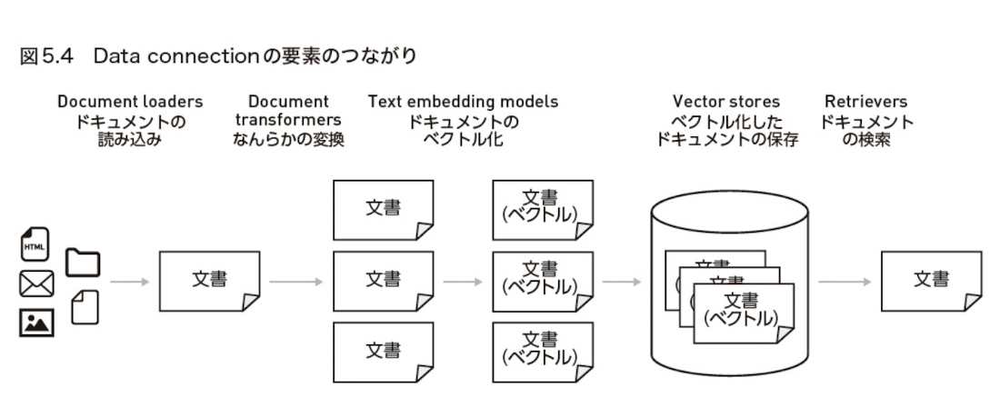
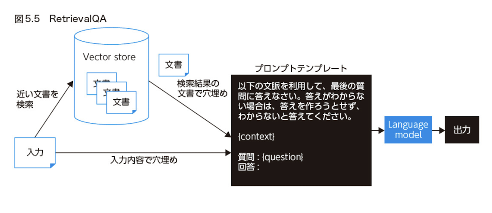
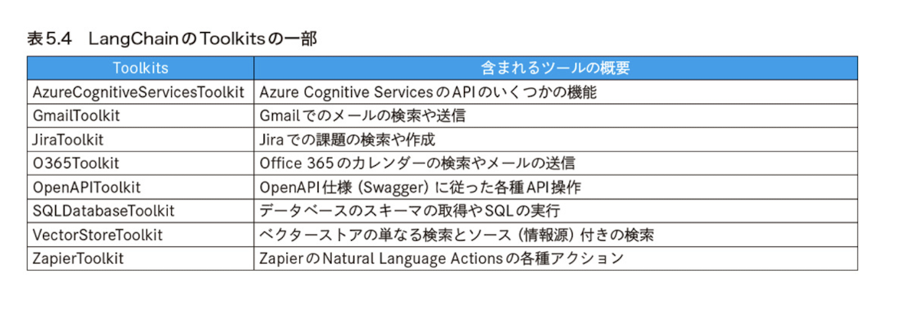

# Chapter 05 - Data connection

data connection は、LLM と外部の data を接続するための機能です。

## 5.1 Data Connection

### RAG(Retrieval Augmented Generation)

文書を OpenAI の Embeddings API などで vector 化しておいて、入力 vector が違い文書を検索して context に含める手法を RAG と呼ぶ
。文書はあらかじめ用意した database から検索する小 t もあれば、Google などの検索 Engine で web 上から検索することも考えられます。

LangChain の Data connection では、とくに Vector store を使い、文書をベクトル化して保存しておいて、入力のテキストとベクトルの近い文書を検索して context に含めて使う方法が提供されています。

### Data Connection の概要

RAG に使える LangChain module が data connection です。Data connection には次の５シュリの機能があります。

- Document Loaders
  - data source から document を読み込む
- Document Trasnformers
  - document に何らかの変換をかける
- Text embedding models
  - document を vector 化する
- Vector stores
  - vector 貸した document の保存先
- Retrievers
  - 入力の text と関連する document を検索する



#### Document loaders

Github Repository で公開されている document を読み込むことにします。まず、GitPython という package を install する。

[DocumentLoader の種類](https://python.langchain.com/docs/integrations/platforms/)

#### Document Transformers

読み込んだ document には何らかの変換をかけること。
ex

- document をある程度の長さで chunk に分解したい場合
  - document を適切な大きさの chunk に文わりすることで、LLM に入力する token 数を削減したり、より正確な回答を得やすくなります。Langchain の CharacterTextSplitter という class を使った document を chunk に分割する例

```py
from langchain.text_splitter import CharacterTextSplitter

text_splitter = CharacterTextSplitter(chunk_size=1000, chunk_overlap=0)

docs = text_splitter.split_documents(raw_docs)
print(len(docs))
```

- LangChain から提供する DocumentTransformaer

  - Html2TextTransformer
    - HTML を plain text に変換する
  - EmbeddingsRedundantFilter
    - 類似した document を除外する
  - OpenAIMetadataTagger
    - metadata を抽出する
  - DoctranTextTranslator
    - document を翻訳する
  - DoctranQATransformer
    - user の質問と関連し訳す

- Link
  - [LangChain から提供する DocumentTransformaer](https://python.langchain.com/docs/integrations/document_transformers)

#### Text embedding models

#### Vector stores

#### Retrievers

text に関連する document を得る interface を Retriever といいます

#### Retrieval QA (Chain)

chatbot などの application としては、入力に関連する文書を取得 (Retrieve) するのに加えて、取得した内容を promptTemplate に context として埋め込んで、LLM に質問して回答(QA) してもらいたい場合があります。



- 他の chain
  - ConversationRetrievalChain

##### (Column) RetrievalQA の chain_type

- stuff
  - 入力と関連する複数の文書を同時に prompt に含めて回答を得る
- map_reduce
  - それぞれおの文書に対して回答を得て(map), その後、最終的な回答を得る(reduce)とい j 流れになります。
- map_rerank
  - map_reduce と同様にそれぞれの文書に対して回答を得ると同時に、LLM が回答に score をつけます。その score が最も高かった回答が、最終的な回答として採用されます。
- refine
  - LLM に 1 つずつ文書を与えて回答を徐々に作らせます。つまり、だんだんと回答を brush up していくような流れになります。
  - refine 処理は、Retrieval QA だけでなく、複数の文書の要約といった usecase でも使うことができます。

## 5.2 Agents

### Agents の概要

RetrievalQA (Chain) では、Vector store を検索して、検索結果を踏まえて LLM に回答させました。LangChain には他にも、LLM の応答をもとに API を呼び出す `OpenAPIEndpointChain` や SQL を実行する `SQLDatabaseChian` といった Chains もあります。

これらの Chains は、固定的な処理の流れを実現するものです。一方で、どんな処理を行うべきか、LLM に選択して動いて欲しい場合があります。

例えば、user の入力を踏まえて、必要に応じて、

- 社内文書を Vector store から検索して回答したり、
- Web 上の情報を検索して回答をしてくれたりする

そんな挙動にできたら、LLM で実現できることは大きく広がります。そのような動作を実現できるのが、LangChain の「Agents」です。

LangChain の Agents を使うと、必要に応じて様々なツールを使いながら、LLM に動作してもらうことができます。
ツールとしては、Vector store を使って特定分野の data を検索して使わせることもできれば、Goolge などの Search Engine API を使わせたりすることもできます。

### Agents の仕組み - ReAct という考え方

先ほど試した [Zero-shot-react-description という Agent](https://colab.research.google.com/drive/1tPvrOlkDeflGfBL7UMIHMLX-7ES6m8KG#scrollTo=o2B_iB8s56fK&line=1&uniqifier=1) は、「ReAct: Synergizaing Reasoning and Acting in Language Models」という論文にモドづく実装で、「ReAct」という仕組みで動いています。

### LangChain の Agents tools

| tool name     | outline                              |
| ------------- | ------------------------------------ |
| terminal      | shell でコマンドを実行する           |
| Python_REPL   | Python code を実行する               |
| google_search | Google で検索する                    |
| Wikipedia     | Wikipedia を検索する                 |
| human         | 人間に入力させる(任官に助けを求める) |

### Toolkits

同時に使う tool をいくつか取りまとめたのが Toolkiets です。例えば、Agents を使って、Github に対して色々な操作をさせたいとします。その際、次のようにいくつもの tool を用意することになります。

- Issue の一覧の取得
- Issue の詳細の取得
- Issue に comment する
- file を作成する
- file を読み込む
- file を更新する
- file 削除する

LangChain で提供されている Toolkits を使うことで、このような Tool をまとめて用意することができます。



### Function Calling を使う OpenAI Functions Agent

ReAct や Plan-and-Solve といった Agent を動かすことができますが、この仕組みでは安定的に動作させるのは簡単ではありません

### 一度に複数 Tool を使う OpenAI Multi Functions Agent
